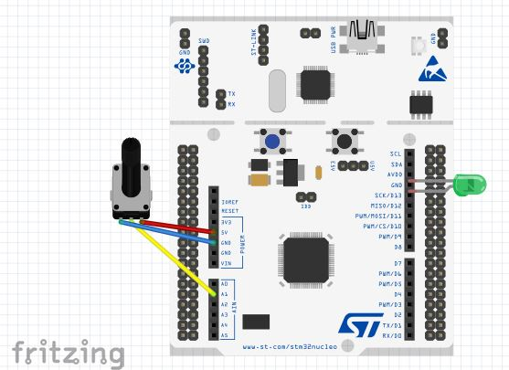

# LED-Dimmer
Proyecto de la asignatura de Diseño De Sistemas Basados en Microprocesadores con MicroPython.

Para ejecutar el script de Micropython:

    make run

Para copiar el programa a la memoria de la STM-Board:

    make deploy-stlink

Para resetear la memoria de la STM-Board:

    make reset

Diseño del sistema con la herramienta de Fritzing:

